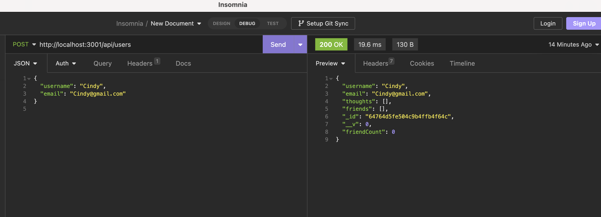
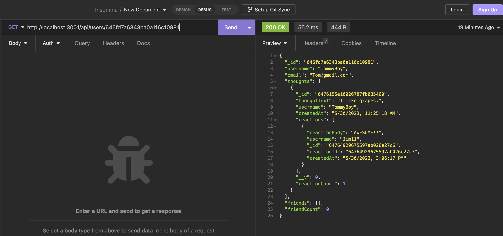
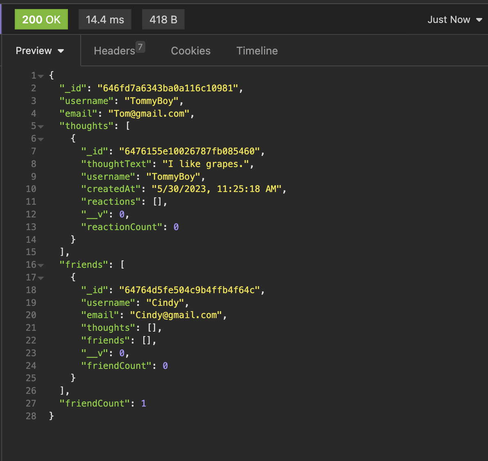
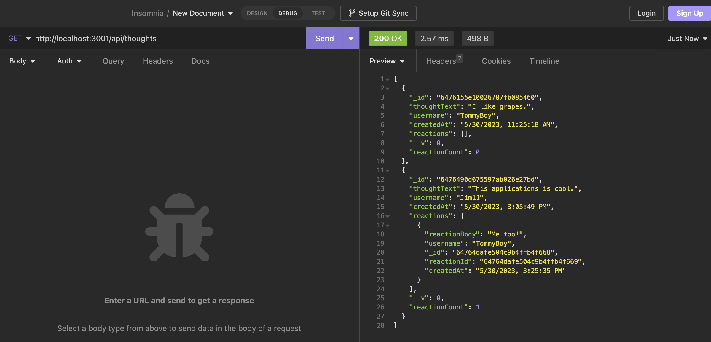
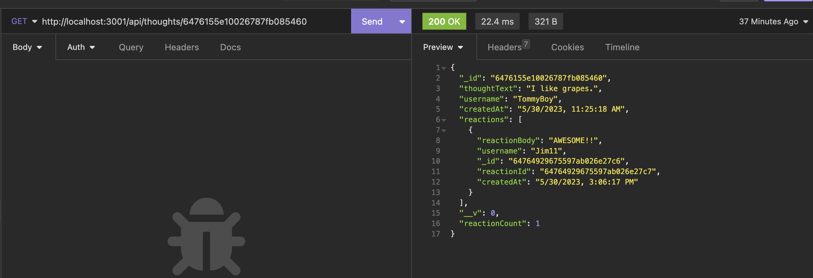

# Social Network API

## Description
This application is an API for a social network application. It was built using Express.js, MongoDB, and the Mongoose ODM.

## Installation
Ensure that you have node, express, and mongoose installed. Clone the repository into VSCode or some other coding application. After that, run "npm start" and navigate to Insomnia. Please note that you will have to seed your own data in this application. 

## Usage
A user must clone the repository and navigate to the correct folder within the terminal. Once the necessary packages are installed, type in "npm start". The user will then be shown the message in the console "API server running on port 3001" to indicate that the server is connected and listening. 

Once in Insomnia or another software of your choice, you can run the GET, POST, PUT and DELETE routes for users and thoughts. Since the repo doesn't contain any seeded data, the user will have to add their own if they would like to test the routes themselves. The below image shows the output for a POST route to add a user.

Once users have been added, there is the option to view all users or see a specific user by including the userId. You can also delete or update pre-exisiting users. Below is an example of viewing a singular user. As you can see, within the data for a user, you will find an array of thoughts and reactions to those thoughts. Additionally, there is an array for friends included, although this one is empty because this user has no current friends. A virtual property was created as well to track the "reactionCount" and the "friendCount" 

If the user wants to add a friend, you can navigate to the post route for adding friends. Once a friend has been added, you can now see what the data will look like if you search by TommyBoy's userId. 

As mentioned, you can also search routes to isolate just the different thoughts. Similar to the users routes, there are routes for specific thoughts by ID and to create, update or delete a thought. 

For these thoughts, you can add a reaction to that thought. The below image shows what a reaction to a specific thought would look like. 

Walkthrough video:

[social-network-api-demo_ May 30, 2023](https://github.com/jacone626/social-network-api/assets/121627491/505b5618-87d0-4f47-a8f0-6afd408f3c5c)

## Credits
N/A

## License
Please refer to the license in the repo.
